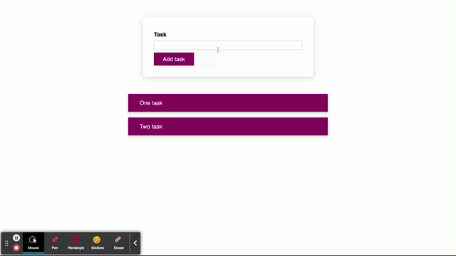

# To do list.

Web application for making a task list.

[To do list app](https://to-do-list-xi-sand.vercel.app)

### Stack:

* React

### Application functionality.

### Get started.

Clone the project

`git clone git@github.com:zakharovdm/to-do-list.git`

Set up the dependencies

`make install`